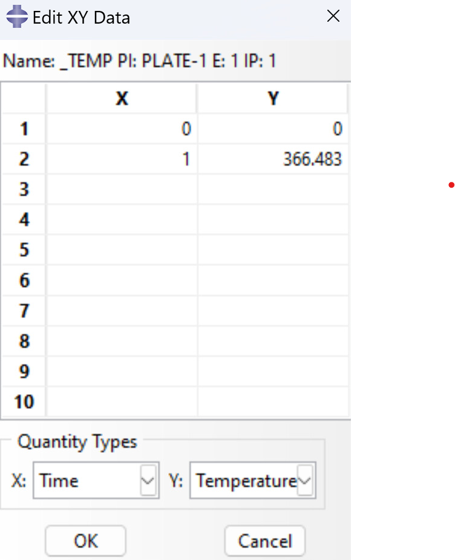
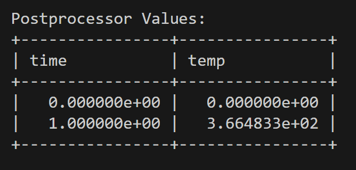

# Description
    The aim of this goal is to simulate a rectangular steel plate under thermal loading.
    These results will be processed and visualized in ParaView and checked against supplemental calculations to ensure validity. 

# Problem Statement:
    There is a 4x10x.25 inch 316L steel metal plate. The bottom of the plate is heated to 200F. dt = .5s and end time is 10 seconds.
    Simulate and process the results.

# Conversions to SI units

    4 x 10 x .25 inches -> 0.1016 x 0.254 x 0.00635 meters.
    200F -> 366.4833K

# Timeline

<!--  -->

## 7/19/2024
### 1:00 PM - 2:00 PM
#### Summary
* Continued working on comparing CSV data
* Decided that an exhaustive comparison will be needed to compare the data

#### Notes:
* Exhaustive comparison consists of checking each column from one file against every column of another. 
    The two columns that are the closest to each other are paired together as the same node across the two simulations. 
* Once the comparisons are made, A new CSV will be generated and analyzed.

### 5:00 PM - 5:30 PM

#### Summary
* Began working on the exhaustive comparison. More complicated than anticipated
<!--  -->

## 7/9/2024
### 8:00 AM - 9:15 AM
#### Summary
* Created script to help with choosing postprocessor coordinates based on mesh

### 2:00 PM - 7:00 PM
#### Summary
* Converted data from Abaqus to CSV. 
* Created script to sanitize redundant time step values in Abaqus CSV data
* Created script to compare values between MOOSE CSV and Abaqus CSV

#### Challenges
* No clear way to compare data, as node data across time steps aren't sorted.

#### Potential Solutions
* Modify compare script to display max and min for each simulation across each time step, if these values are close to each other then calculations are correct?

#### Goals/TODO:
* Reach out to research peers/professor and ask for guidance on comparing result data.
* Finish Script on comparing data
* Analyze compared data, decide whether or not simulations are successful

<!--  -->

## 7/5/2024
### 12:00PM - 2:10PM
#### Summary
* Abaqus simulation for transient execution complete
#### Goals/TODO:
* Analyze outputs from MOOSE transient execution and compare to Abaqus
* Finish PostHelper.py to aid with postprocessing section for input file.

<!--  -->

## 7/3/2024:
### 12:00 PM - 4:00 PM
#### Summary
* Abaqus simulation for steady execution complete
* Results processed and compared between MOOSE and Abaqus

#### Results:
As you can see in the following two images, the data is almost a perfect match. This affirms that the calculations ran in MOOSE are correct.

##### Abaqus:

##### MOOSE:

#### Goals/TODO:

* Run Goal1 transient execution in Abaqus
* Compare results with moose

<!--  -->

## 7/2/2024:
### 1:00 PM - 3:00 PM
#### Summary
* Abaqus Tutorial

#### Goals/TODO:
* Finish Abaqus Tutorial
* Run simulations in Abaqus and compare results

<!--  -->

## 7/1/2024:
### 12:00 PM - 2:45 PM
#### Summary
* ParaView now showing heat data on mesh.
* Created Transient version of Goal1Steady.i

#### Notes:
Not sure what changed, but after a lot of messing around in ParaView the meshes now display heat correctly.

#### Goals/TODO:
* Run simulations in Abaqus and compare results.
* Look into converting simulation into Python script through ParaView.

### 2:45 PM - 3:40 PM
#### Summary
* Laptop crashed with blue screen. Had to install new update and restart a few times to get things working smoothly again.
* Installed VMWare Horizon Client and connected to remote lab.

#### Goals/TODO:
* Begin Abaqus tutorials
* Run simulations in Abaqus and compare results

<!--  -->

## 6/27/2024:

### 1:00 PM - 5:00 PM
#### Summary
* Researched Heat Conduction.
* Created input file and Ran calculation.
* Reinstalled ParaView onto Windows OS directly instead of WSL Ubuntu.
    * This solved failure to render mesh from output file issue.

#### Notes:
* ParaView not immediately displaying results from calculations, just mesh.
    * Need to research Viewing data and mesh in ParaView more.

#### Goals/TODO:
* Research viewing data and mesh in ParaView.
* If not a problem with ParaView, ensure that input file is correct and calculations are running fine.
* Copy Goal1Steady.i input file and rewrite it for a transient execution type to meet goal requirements.